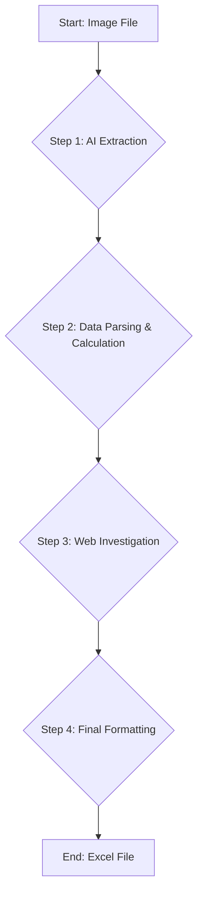

# System Patterns: Data Processing Pipeline

## 1. System Architecture

The system is designed as a linear, multi-stage data processing pipeline, orchestrated by the `process_image.py` script. Each stage performs a distinct transformation on the data before passing it to the next.

- **Stage 1: AI Extraction (`process_document_with_ai`)**: This function is the entry point for raw data. It takes the image, communicates with the external Mistral AI service, and returns a structured JSON object. The schema sent to the AI is crucial for getting a predictable response.

- **Stage 2: Data Parsing & Calculation (`parse_and_transform_data`)**: This is the core logic hub. It takes the AI's response, converts text to numbers, and performs all the financial calculations.

- **Stage 3: Web Investigation (`get_property_tax_info`)**: This function is a specialized sub-process called by Stage 2. It handles the external web search based on the flowchart logic, demonstrating a pattern of delegating complex, isolated tasks to dedicated functions.

- **Stage 4: Final Formatting (`parse_and_transform_data`)**: After all data is calculated and retrieved, this stage applies the final, precise formatting rules.

- **Stage 5: Output (`save_to_excel`)**: The final stage takes the fully processed data and saves it to an Excel file.

## 2. Key Technical Decisions

- **Modular Functions:** The script is broken down into distinct functions, each with a single responsibility (e.g., `get_api_key`, `encode_image_to_base64`, `get_property_tax_info`). This makes the code easier to read, test, and maintain.

- **Schema-Driven Extraction:** Instead of relying on the AI to guess the data structure, we provide a specific JSON schema in the API call. This forces the AI to return data in a more predictable format, reducing the risk of parsing errors.

- **Error Handling for Web Requests:** The `get_property_tax_info` function includes a `try...except` block to gracefully handle web-related errors (like the "404 Not Found" error). It also includes specific logic to follow the flowchart's fallback procedures.

- **Configuration via Environment Variables:** The API key is stored outside the code as an environment variable. This is a critical security pattern that separates configuration from the application logic.

- **Hardcoded Fallbacks and Placeholders:** For parts of the process where external data is unavailable (like the final property tax rate from a database), the script uses hardcoded placeholder values. This was a deliberate decision to allow the end-to-end pipeline to be tested while acknowledging the dependency on an external data source.
